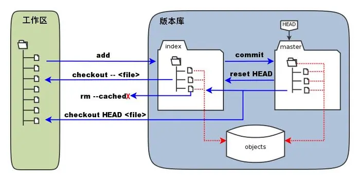

## Git 流程图

图取自网络。


## Git 还原
**还原**，一般指还原**工作区**的文件修改。使用 `git checkout` 可以还原工作区被修改的文件。

不同情况下，还原操作也不同。

- 修改了文件，但未加入索引
```
git checkout -- test.txt    // 从索引还原 test.txt 文件到工作区
git checkout -- *           // 从索引换到所有文件到工作区
```

- 修改了文件，且加入了索引，但未提交

    还原的核心是**如何还原索引**，并从索引检出到工作区。

    方法一：`git checkout HEAD -- test.txt`，即将文件从 HEAD 还原到索引，并从索引检出到工作区。这种方式还可以还原指定提交的文件到工作区，例如还原文件到上一次提交。
    ```
    git checkout HEAD -- test.txt  // 从HEAD还原文件修改
    git checkout HEAD^ -- test.txt // test.txt 还原到上一次提交
    ```

    方法二：借助 `git reset` 来实现。
    ```
    git reset HEAD              // 重置索引
    git checkout -- test.txt    // 从索引检出到工作区
    ```

- 修改了文件且已提交

    方法一：`git checkout HEAD^ -- test.txt` 直接从 HEAD^ 还原，这种还原方式可以保留上一次 commit 信息。

    方法二：同样借助 `git reset`，但是会丢失上一次的 commit 信息。
    ```
    git reset HEAD^             // 重置索引到上一次提交
    git checkout -- test.txt    // 检出文件
    ```

## Git 回退
**回退**，一般用于撤销提交，使用的是 `git reset` 命令，它能修改 HEAD 指针，另外，可以通过参数来控制修改索引和工作区。其参数如下：

- `mixed`，重置HEAD，重置 index，保留工作区（*默认参数*）

    一般用于撤销提交，例如发现提交的部分代码出现错误，可以先回退到上一个版本 ` git reset HEAD^`，编辑后再次提交即可。

- `soft`，重置HEAD，保留 index，保留工作区

    一般用来修改 commit 信息，例如提交的消息有错别字想修改正确，可以如下操作：
    ```
    git reset --soft HEAD^
    git commit -m "xxxx"
    ```

    当然也可以撤销 git reset soft head操作，先通过git reflog找到上一次的历史提交记录id，然后 `git reset --hard [id]`。

- `hard`，重置HEAD，重置 index，重置工作区

    一般用于强制回退版本，且大部分情况都要重置远程仓库。
    ```
    git reset --hard [id]   // 回退到指定commit id
    git push -f             // 强制推送到远端
    或者
    git push -f -u origin develop // 强制推送到指定的远端分支
    ```

    需要注意的是，hard reset 后只影响了本地仓库 A，其他的本地仓库 B 也同样需要 hard reset，当仓库 B 拉取被重置的远端分支时，并不会合并或rebase任何东西，要特别注意，否则会导致 A 的回退操作被撤销，因为 B 又把 HEAD 推送到远端了，因此需要在 B 执行 `git reset --hard origin/master`。


## git diff 命令
- `git diff`，比较的是工作区和暂存区的差别
- `git diff --cached`，比较的是暂存区和版本库的差别
- `git diff HEAD`，可以查看工作区和版本库的差别