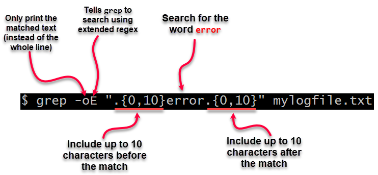

## 查看进程启动的精确时间
```
ps -eo pid,lstart,etime,cmd | grep nginx
```
查看 man 手册 (`man ps`)，可以看到 `lstart` 和 `etime` 的含义：
- `lstart` STARTED   time the command started. 即命令启动时间。
- `etime`  ELAPSED   elapsed time since the process was started, in the form [[DD-]hh:]mm:ss. 即从进程启动后流逝的时间。

参考：[Linux ps 命令查看进程启动及运行时间](https://www.cnblogs.com/weifeng1463/p/8807849.html)

## 使用AWK将列用指定连接符拼接
示例文件 test.txt 内容如下:
```
AAAA 12345 xccvbn
BBBB 43431 fkodks
CCCC 51234 plafad
```

要获得 `AAAA,BBBB,CCCC`，即使用连接符 `,` 将每一行的第一列拼接起来。可以这样:
```bash
# 若不想输出的内容换行,则不加后面的 END{print ""}
# 方法1
awk '{printf "%s%s",sep,$1; sep=","} END{print ""}' test.txt

# 方法2
awk 'BEGIN{ORS=","}{print $1}' test.txt | sed 's/,$//'
```

## AWK中的分隔符
下面列出 `RS`、`ORS`、`FS`、`OFS` 的含义：
- `RS`，row separator，即**输入行分隔符**
- `ORS`，out row separator，即**输出行分隔符**
- `FS`，field separator，即**输入列分隔符**
- `OFS`，field separator，即**输出列分隔符**

行分隔符默认为 `\n`，即换行符；列分隔符默认为空格` `或制表符`\t`。

- 示例1：
    ```
    # 指定 输入行分隔符
    echo "111#222|333#444|555#666" | awk 'BEGIN{RS="|"} {print $0} END{print "---"}'

    # 输出
    111#222
    333#444
    555#666
            #注意，这里还有一个空行，因为 echo 命令输出的内容后面会带一个换行符
    ---
    ```

- 示例2：
    ```
    # 指定 行输入分隔符 和 行输出分隔符
    echo "111#222|333#444|555#666" | awk 'BEGIN{RS="|";ORS="$"} {print $0}'

    # 输出
    111#222$333#444$555#666
    ```

- 示例3：
    ```
    # 指定 输入行分割符 和 输入列分隔符
    echo "111#222|333#444|555#666" | awk 'BEGIN{RS="|";FS="#"} {print $1}'

    # 输出
    111
    333
    555
    ```

- 示例4：
    ```
    # 指定 输入行分割符、输入列分隔符 和 输出列分隔符
    echo "111#222|333#444|555#666" | awk 'BEGIN{RS="|";FS="#";OFS="-"} {print $1,$2}'

    # 输出
    111-222
    333-444
    555-666
     
    ```

## 截断grep返回的长匹配行
当使用grep 返回的匹配行过长，影响关键数据的查询，可以对匹配行进行截断，有两种方法：
- 方法一，使用 `-E` 参数，配合 `-o`参数。
```
#表示截取匹配到的行的关键词 BattleReport 前后10个字符，而不显示整行
grep -oE '.{0,10}BattleReport.{10}' xxx.log
```
截取方式入下图（图片引用字 stackoverflow）：


- 方法二，使用 `-P` 参数，即使用 perl 正则匹配，配合 `-o` 来达到截取效果。
```
grep -oP '.*(?=BattleReport)' xxx.log
```

perl 的四种表达式：
- `(?=...)`：表示从左向右的顺序环视。例如(?=\d)表示当前字符的右边是一个数字时就满足条件
- `(?!...)`：表示顺序环视的取反。如(?!\d)表示当前字符的右边不是一个数字时就满足条件
- `(?<=...)`：表示从右向左的逆序环视。例如(?<=\d)表示当前字符的左边是一个数字时就满足条件
- `(?<!...)`：表示逆序环视的取反。如(?<!\d)表示当前字符的左边不是一个数字时就满足条件

示例文件 test.log 内容如下：
```
email1=aaa@163.com
email2=bbb@qq.com
```

匹配输出结果：
```
grep -oP '.*(?=@163\.com)' test.log
# 输出：email1=aaa

grep -oP '(?=aaa).*' test.log
# 输出：aaa@163.com

grep -oP '.*(?<=aaa)' test.log
# 输出：email1=aaa
```

参考：
[How to truncate long matching lines returned by grep or ack](https://stackoverflow.com/questions/2034799/how-to-truncate-long-matching-lines-returned-by-grep-or-ack)、[grep 与 perl 正则 AWK](https://www.jianshu.com/p/dd5b97f9385a)、[linux grep命令的-P和-o选项的作用](https://www.cnblogs.com/onelikeone/p/16415452.html)